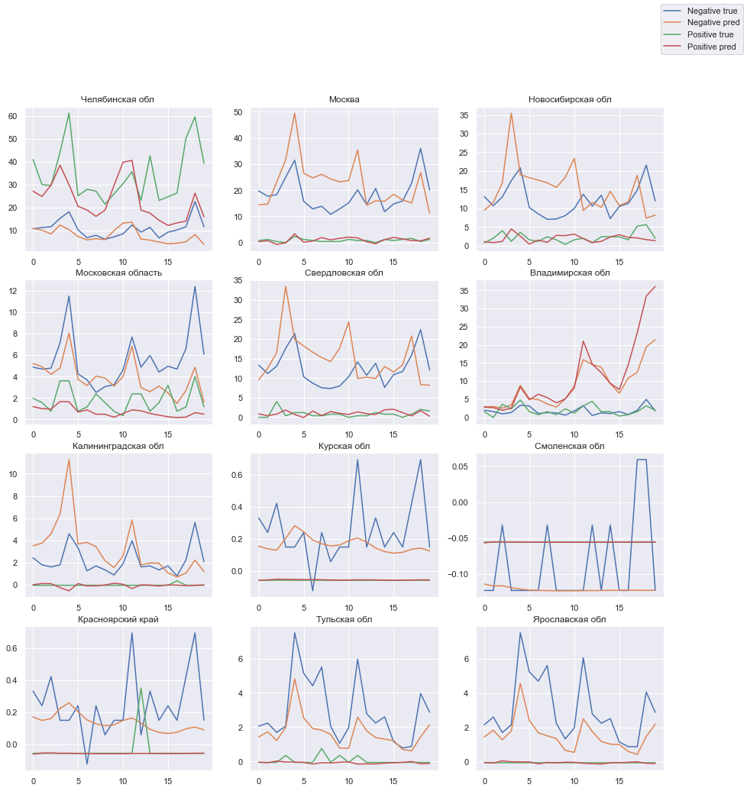

## Description
Solution from BCG Gamma 2021 hackathon.

### Task
Develop a model for predicting the number of ticks sent for disease testing in the laboratory and diseases rates.  
Comparison metric - **MAE**.

## Results
Developed LSTM neural network model.  
As additional features weather information was taken.

**Test predictions:**  

**Data visualization:**  
https://datalens.yandex/mfpleva12pquf
